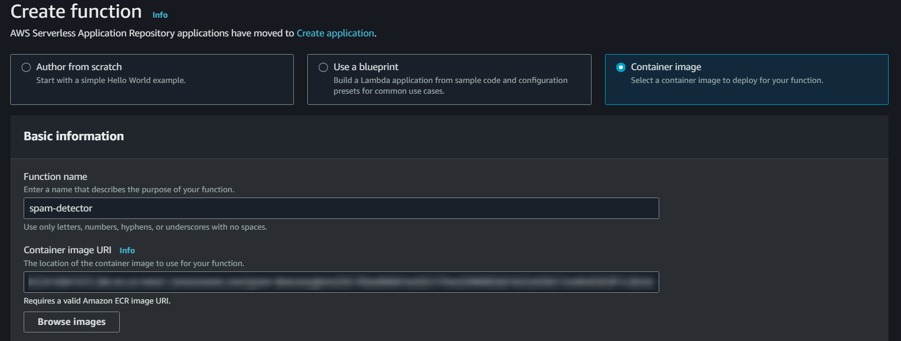
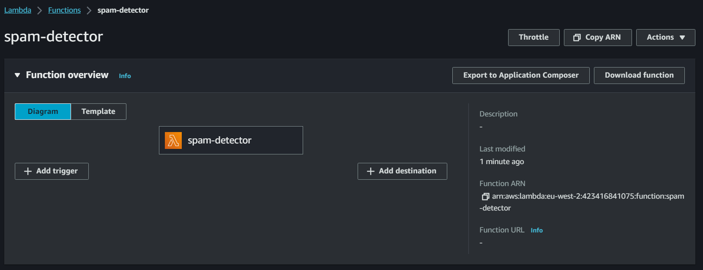
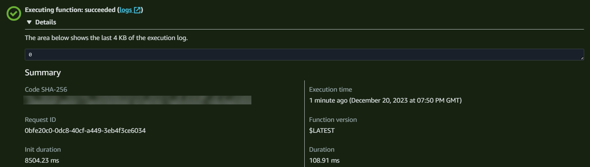
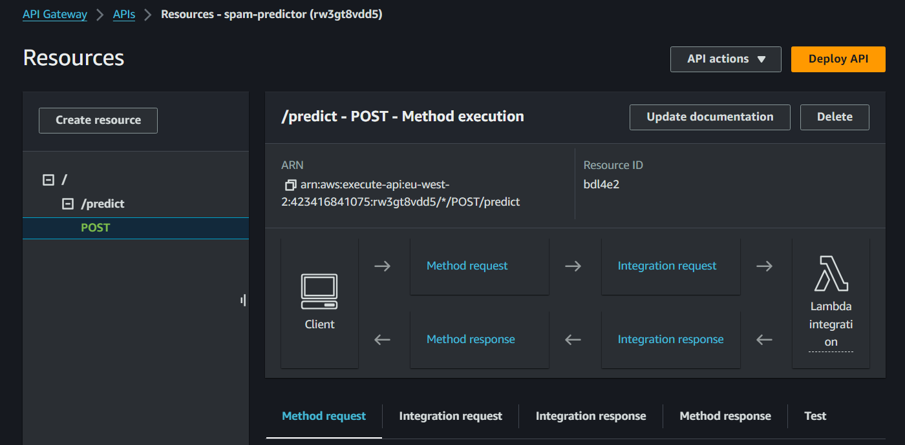
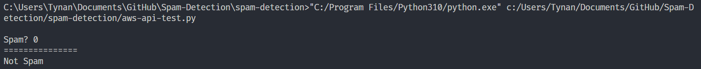

# Spam Detection

Spam is an issue that has persisted since the beginning of email. It makes up a great deal of email flows and causes a great deal of disruption each year. For example, each year millions of users fall victim to scams which are delivered through mass spam emails. Furthermore, spam is often associated with causes disruption to computer systems which damages property and hinders productivity. It is for reasons such as this that companies invest time and money into sophisticated spam-filtering systems. For this project, I will be attempting to create an SMS spam-filtering model using machine learning. 

## Project outline

> 1. Explore and preprocess the data with `Pandas, Matplotlib and Seaborn`
> 2. Train and evaluate multiple models, identifying the most suitable one using `Scikit-Learn`
> 3. Export the model using `Pickle`
> 4. Contain the model in a virtual environment using `Poetry`
> 5. Create a `Docker` image and push to `AWS - Elastic Container Registry (ECR)`
> 6. Create an `AWS - Lambda Function` from said image and expose using a `Rest API` with `AWS - API Gateway`.

## Notebook Summary

> 1. Importing and understanding the data
> 2. Exploratory Data Analysis (EDA)
> 3. Preprocessing the language data
> 4. Training and evaluating models
> 5. Model fine-tuning

# Managing dependencies with Poetry

Generate a poetry project file (**`pyproject.toml`**) using `poetry new <name>` or `poetry init <name>`. 

Dependencies can be specified by manually updating the `[tool.poetry.dependencies]` in the project file or by running `poetry add <dependency names here>`.

Example:

```
> poetry new spam-detection
> poetry add numpy pandas scikit-learn matplotlib
```

### Using Poetry virtualenv in VSCode

1. Localize virtual environment

```
> poetry env list
> poetry env remove <venv name>
> poetry install 
```
A `.venv` folder should now appear in the project directory.

2. Activate virtual environment using `poetry shell`
3. In the shell, initialise a Jupyter instance with `poetry run jupyter notebook` 
```
> poetry shell
> poetry run jupyter notebook
```
A localhost Jupyter server should now be running - connecting to this within VSCode can be done via `Select Interpreter > Existing Jupyter Server > ...`.

# NLTK Dependencies


> **Note:** Due to technical difficulties with using `nltk.download`, I have manually sourced the NLTK `WordNet`, `punkt` and `stopwords` dependencies. If you want to use these files, instead of `nltk.download`, be sure to first run `nltk.data.path.append('//nltk_data')`.

# Docker

To build and run the Dockerfile, type the following into a terminal:

```
> docker build -t spam-detection .
> docker run -it --rm -p PORT:PORT spam-detection:latest
```

The Dockerfile does two key things:

> 1. Installs Poetry and fetches dependencies from lock file
> 2. Copies the `model.bin` and `lambda_function.py` which are the machine learning model and lambda_function with lambda_handler, respectively.

The lambda_function is integral to deploying the model to AWS Lambda.


# AWS ECR

To create a new AWS ECR repository and connect to it:

```
> aws ecr create-repository --repository-name spam-detector
> aws ecr get-login --no-include-email
```

Once the repository has been created, tag the docker image you wish to push using the repository's URI which can be fetched from the command line or the ECR dashboard. After tagging, push using `docker push` followed by the URI.


```
> docker tag spam-detector:latest 423416841075.dkr.ecr.eu-west-2.amazonaws.com/spam-detector
> docker push 423416841075.dkr.ecr.eu-west-2.amazonaws.com/spam-detector
```


Figure 1. ECR dashboard with newly-created repository.

# Lambda Function

Once an image has been established and pushed to AWS ECR, we want to create our Lambda function. We create our Lambda function using `from container` and select the ECR image.



Figure 2. Initialising the Lambda function, calling the container image we previously pushed.

Now that we've created the Lambda function, we can test the function with a custom test case.



Figure 3. The Lambda function.



Figure 4. Successfully testing the Lambda function using "Hello, my name is Connor!"

# REST API

The Lambda function is working as intended, but we need to expose the function if we're to call it from our local machine. For this we will use API Gateway to create a REST API.

Creating a new `resource` utilising the POST method and selecting our Lambda function as our `method` of choice, we can deploy the API and test its functionality by calling it from our local machine.



Figure 5. REST API using the POST method and communicating with our Lambda function.

Using `aws-api-test.py` we call the Lambda function...



Figure 6. Successfully calling the Lambda function using the REST API.

...and success!